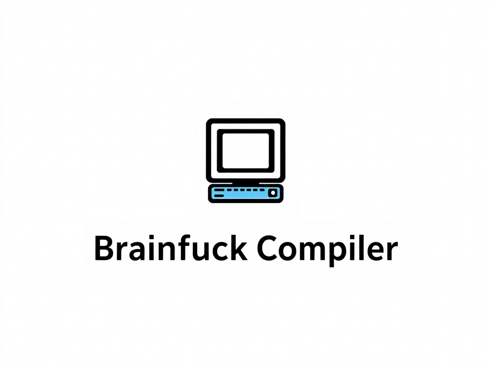

> A lightweight and standards-compliant Brainfuck interpreter written in C++

## Features
- ✅ Full support for Brainfuck standard commands: `+ - . , [ ] < >`
- 🧠 30,000 memory cells with 8-bit wrapping values
- 📂 Read from file or standard input
- 🔍 Bracket matching validation to catch syntax errors
- 🚫 Data pointer bounds checking to prevent overflow/underflow
- 🧰 Built-in help and version info

## Compilation (Using MingW)
### Requirements
- MingW compiler (included in MSYS2)
- Ensure `g++` is available in your PATH

### Build Instructions
```bash
# Navigate to the root directory containing main.cpp
cd path/to/project-root

# Compile using MingW g++
g++ main.cpp -o brainfuck.exe -Wall -Wextra -O2
```
> ⚠️ Warning: This project uses getopt_long, which is available on Windows via MingW.
### Options
| Flag        | Description                  |
|:------------|:----------------------------:|
| `-h`, `--help`   | Show this help message       |
| `-v`, `--version`| Show version information     |

### Examples
| Description                          | Command                                  |
|--------------------------------------|------------------------------------------|
| Run a Brainfuck program from file   | `brainfuck examples/hello.bf`           |
| Run interactively (echo program)    | `brainfuck` followed by typing `,[.,]`  |
| Display help message                | `brainfuck --help`                      |
| Show version information            | `brainfuck --version`                   |

